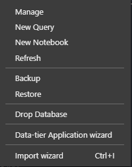

# Drop Database Extension

This extension add a Drop Database command to the right-click context menu within the Azure Data Studio database tree.

After installing this extension simply right-click on any database name and select "Drop Database".
The database will be removed and the database tree will be refreshed.

## Installation

The current release is available to download as a .vsix file and can be installed by opening the File Menu and selecting `Install Extension from VSIX Package`

## Change Log

See changes here - [Changelog](CHANGELOG.md)

## License

Licensed under the [MIT](LICENSE.txt) License.
